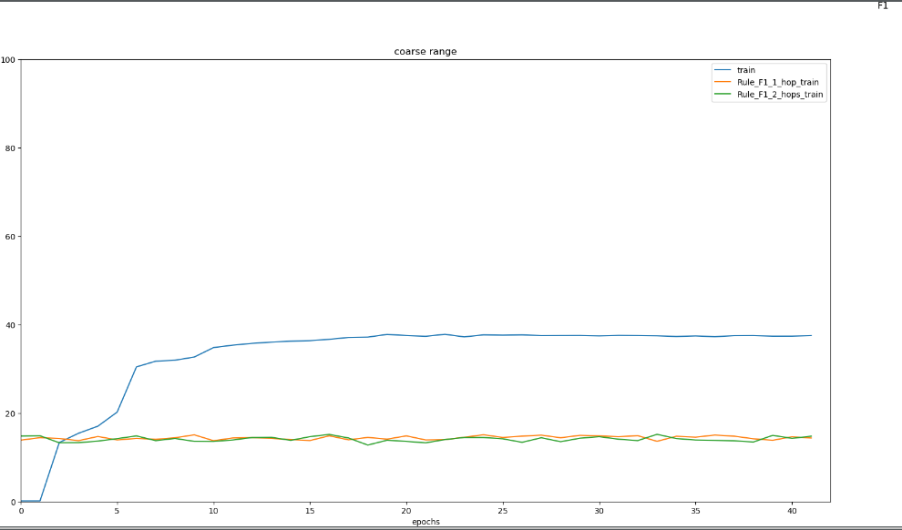

# MemN2N in Knowledge Embedding
Use [End-To-End Memory Network](https://arxiv.org/abs/1503.08895) to perform topic transfer in the first step. 


## Training

#### LicDataset

```shell
DATA_PATH = data/lic/toyDataset.py # for toyLic
DATA_PATH = data/lic/licDataset.py # for Lic
python src/run.py -c config/cfg.py -d $DATA_PATH -m models/trainer.py -o result -mode train -v --net.net_path models/memn2n.py --device cpu --init.loss_func bce  --train.batch_size 32 --valid.batch_size 32
```

#### bAbIDataset
```shell
DATA_PATH = data/bAbI/bAbIDataset.py # for bAbI
python src/run.py -c config/cfg.py -d data/bAbI/bAbIDataset.py -m models/trainer.py -o result -mode train -v --net.net_path models/memn2n.py --init.loss_func ce --train.batch_size 32 --valid.batch_size 32
```

## Test

#### pureRule
```shell
DATA_PATH = data/lic/toyDataset.py # for toyLic
DATA_PATH = data/lic/licDataset.py # for Lic
python models/run.py -c config/cfg.py -d $DATA_PATH -m models/trainer.py -o result -mode eval -v --net.net_path models/memn2n.py --init.loss_func bce --net.saved_params_path result/final_params.ptp
```

#### MemN2N + Rule
```shell
DATA_PATH = data/lic/toyDataset.py # for toyLic
DATA_PATH = data/lic/licDataset.py # for Lic
python src/run.py -c config/cfg.py -d $DATA_PATH -m models/trainer.py -o result -mode eval -v --net.net_path models/memn2n.py --init.loss_func bce --net.saved_params_path result/final_params.ptp --test.batch_size 32
```

## Results

To be continued